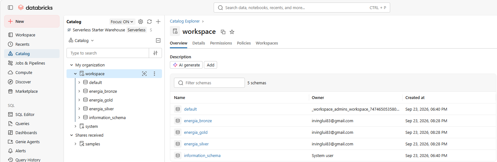
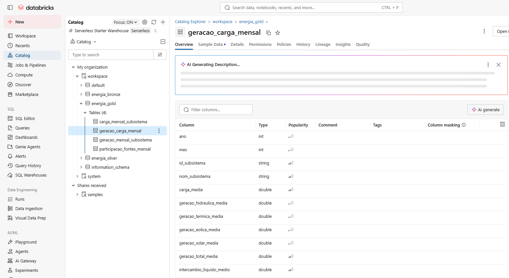
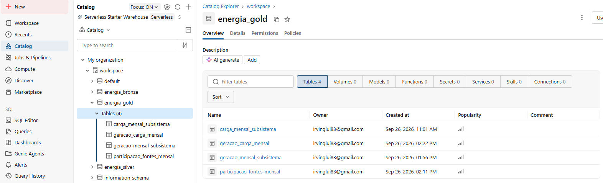
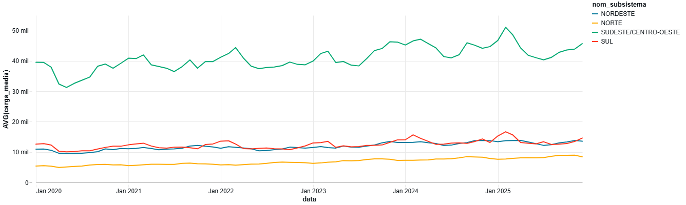
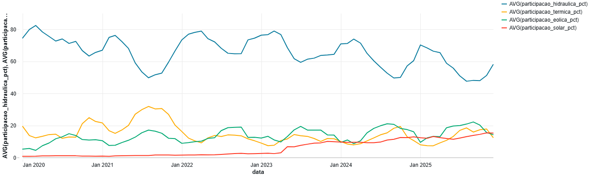
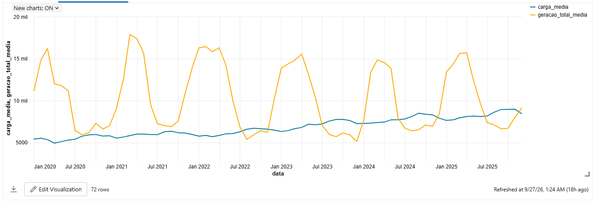

# MVP de Engenharia de Dados
## Análise da Geração e da Carga de Energia Elétrica no Brasil

**Nome:** Irving Lui de Souza Caetano  
**Matrícula:** 4052026000483  
**Curso:** Ciência de Dados e Analytics — PUC-Rio  
**Sprint:** Engenharia de Dados

---

Este repositório apresenta o desenvolvimento de um **MVP de Engenharia de Dados**, construído em ambiente de nuvem utilizando o **Databricks**.

O projeto utiliza dados públicos disponibilizados pelo **Operador Nacional do Sistema Elétrico (ONS)**, por meio do conjunto de dados **Balanço de Energia nos Subsistemas**, considerando o período de **2020 a 2025**.

O objetivo é construir um pipeline de dados capaz de realizar a ingestão, armazenamento, tratamento, padronização, verificação da qualidade e modelagem dos dados relacionados à **geração e à carga de energia elétrica no Sistema Interligado Nacional (SIN)**.

A solução foi estruturada seguindo os princípios da **Arquitetura Medalhão**, organizando os dados nas camadas **Bronze, Silver e Gold**, até a disponibilização das informações tratadas para análise.

---

## Contexto de Negócio

A energia elétrica é um recurso essencial para o funcionamento da sociedade e para o desenvolvimento econômico. No Brasil, o **Sistema Interligado Nacional (SIN)** integra diferentes regiões e permite a operação coordenada de diversas fontes de geração de energia elétrica.

A matriz representada no conjunto de dados analisado contempla diferentes fontes de geração, entre elas **hidrelétrica, térmica, eólica e solar**. Ao mesmo tempo, a carga de energia elétrica apresenta variações ao longo do tempo e entre os diferentes subsistemas do SIN.

Neste projeto, os dados históricos do ONS são organizados em um pipeline de Engenharia de Dados, permitindo analisar o comportamento da geração e da carga ao longo do período estudado.

---

## Problema

Os dados relacionados à geração e à carga de energia elétrica estão disponíveis em fontes públicas, porém precisam ser coletados, organizados, tratados e modelados para que possam ser utilizados de forma estruturada em análises.

Diante desse cenário, o problema abordado neste MVP consiste em estruturar dados históricos do setor elétrico brasileiro de forma que seja possível analisar o comportamento da carga e da geração elétrica, considerando diferentes períodos, subsistemas e fontes de geração.

---

## Objetivo

Desenvolver um pipeline de dados em ambiente de nuvem utilizando dados públicos do ONS, estruturando informações históricas sobre geração e carga de energia elétrica no Sistema Interligado Nacional.

O pipeline contempla as etapas de **ingestão, armazenamento, tratamento, padronização, verificação da qualidade, modelagem e análise dos dados**, utilizando o Databricks e a Arquitetura Medalhão.

---

## Perguntas de Negócio

O desenvolvimento do pipeline e das análises foi orientado pelas seguintes perguntas de negócio:

1. **Como a carga de energia elétrica varia ao longo do tempo nos diferentes subsistemas do Sistema Interligado Nacional?**

2. **Como está distribuída a geração de energia elétrica entre as diferentes fontes de geração, como hidrelétrica, térmica, eólica e solar?**

3. **Como evoluiu a participação das diferentes fontes de geração de energia elétrica ao longo do período analisado?**

4. **Como o comportamento da geração de energia elétrica se relaciona com as variações da carga nos diferentes subsistemas do SIN?**

---

## Fonte dos Dados

Os dados utilizados neste MVP são provenientes do **Operador Nacional do Sistema Elétrico (ONS)**.

- **Conjunto de dados:** Balanço de Energia nos Subsistemas
- **Período utilizado:** 2020 a 2025
- **Granularidade dos dados de origem:** horária
- **Formato utilizado na ingestão:** Parquet
- **Abrangência:** subsistemas do Sistema Interligado Nacional (SIN)
- **Principais informações utilizadas:** carga e geração hidráulica, térmica, eólica e solar
- **Licença informada pela fonte:** Creative Commons Attribution (CC BY)

Os arquivos anuais foram obtidos a partir da fonte pública do ONS e posteriormente processados no Databricks.

---

## Carga dos Dados

A coleta dos dados foi realizada no notebook `mvp2-download.ipynb`, responsável pelo download dos arquivos anuais do conjunto de dados **Balanço de Energia nos Subsistemas**, disponibilizado pelo Operador Nacional do Sistema Elétrico (ONS).

Foram coletados arquivos no formato Parquet referentes aos anos de **2020 a 2025**. Durante a execução, o processo valida a disponibilidade dos arquivos e realiza a leitura dos dados com Apache Spark.

Os seis arquivos anuais totalizaram **263.040 registros**. Após a coleta, esses dados foram utilizados como entrada para o notebook `mvp3-bronze.ipynb`, responsável pela ingestão e persistência da camada Bronze no Databricks.

O código utilizado para a coleta e validação dos arquivos está disponível neste repositório no notebook `mvp2-download.ipynb`.

---

## Arquitetura do Pipeline

O projeto foi desenvolvido no **Databricks** seguindo os princípios da **Arquitetura Medalhão**, organizando os dados em diferentes camadas de acordo com o nível de processamento.

O fluxo implementado no MVP pode ser representado da seguinte forma:

**ONS → Download dos arquivos Parquet → Bronze → Silver → Gold → Análises**

### Camada Bronze

A camada Bronze recebe os dados provenientes dos arquivos Parquet disponibilizados pelo ONS, mantendo-os próximos ao formato de origem e preservando seus valores para as etapas posteriores de tratamento.

Durante a ingestão foi identificada uma diferença de esquema entre os arquivos anuais: algumas variáveis numéricas estavam armazenadas como `string` nos arquivos de 2020 a 2022 e como `double` nos arquivos de 2023 a 2025.

Para permitir a união dos arquivos sem perda de dados, essas colunas foram padronizadas como `string` na Bronze, deixando a conversão semântica dos tipos para a camada Silver.

**Tabela criada:**

`workspace.energia_bronze.balanco_energia_subsistema`

### Camada Silver

Na camada Silver são realizadas as verificações de qualidade, padronização dos tipos de dados e preparação das informações.

Foram verificadas:

- presença de valores nulos;
- registros duplicados;
- valores vazios nas métricas;
- valores não conversíveis para tipo numérico;
- cobertura temporal;
- consistência dos subsistemas por instante.

As seis métricas provenientes da Bronze foram convertidas para `double`, e foram adicionados os atributos temporais `ano`, `mes`, `dia` e `hora`.

Após as verificações e transformações, a camada Silver permaneceu com **263.040 registros**, sem necessidade de descarte de registros.

**Tabela criada:**

`workspace.energia_silver.balanco_energia_subsistema`

### Camada Gold

A camada Gold disponibiliza dados agregados e preparados especificamente para responder às perguntas de negócio do projeto.

Foram criadas quatro tabelas:

- `workspace.energia_gold.carga_mensal_subsistema`
- `workspace.energia_gold.geracao_mensal_subsistema`
- `workspace.energia_gold.participacao_fontes_mensal`
- `workspace.energia_gold.geracao_carga_mensal`

As tabelas Gold possuem granularidade mensal e permitem analisar a carga, a geração por fonte, a participação das fontes e a relação entre geração, carga e intercâmbio líquido.

Cada tabela possui **360 registros**, correspondentes a 6 anos × 12 meses × 5 identificações presentes nos dados (quatro subsistemas regionais e o registro agregado do SIN).

Os dados das camadas Bronze, Silver e Gold foram persistidos em tabelas no formato **Delta**.

---
## Modelagem e Catálogo de Dados

A modelagem dos dados foi organizada seguindo a Arquitetura Medalhão, utilizando o catálogo `workspace` do Databricks. Foram criados três schemas para representar as diferentes etapas de processamento do pipeline:

- `energia_bronze`: armazena os dados provenientes da fonte, mantendo os valores próximos ao formato de origem.
- `energia_silver`: contém os dados tratados, padronizados e enriquecidos com atributos temporais.
- `energia_gold`: disponibiliza os dados agregados e preparados para responder às perguntas de negócio do projeto.

A imagem a seguir apresenta a organização desses schemas no Catalog Explorer do Databricks.

*Figura 4 — Organização dos schemas Bronze, Silver e Gold no Catalog Explorer do Databricks.*

### Catálogo das tabelas Gold

A camada Gold foi modelada com granularidade mensal e contém quatro tabelas analíticas. Cada tabela possui 360 registros, correspondentes a 6 anos × 12 meses × 5 identificações presentes no conjunto de dados (quatro subsistemas regionais e o registro agregado do SIN).

#### `carga_mensal_subsistema`

Tabela destinada à análise mensal da carga de energia elétrica por subsistema.

| Coluna | Tipo | Descrição |
|---|---|---|
| `ano` | int | Ano de referência do registro. |
| `mes` | int | Mês de referência do registro. |
| `id_subsistema` | string | Identificador do subsistema. |
| `nom_subsistema` | string | Nome do subsistema. |
| `carga_media` | double | Valor médio mensal da carga. |
| `carga_minima` | double | Menor valor de carga observado no período mensal. |
| `carga_maxima` | double | Maior valor de carga observado no período mensal. |

#### `geracao_mensal_subsistema`

Tabela destinada à análise mensal da geração de energia elétrica por fonte e por subsistema.

| Coluna | Tipo | Descrição |
|---|---|---|
| `ano` | int | Ano de referência do registro. |
| `mes` | int | Mês de referência do registro. |
| `id_subsistema` | string | Identificador do subsistema. |
| `nom_subsistema` | string | Nome do subsistema. |
| `geracao_hidraulica_media` | double | Valor médio mensal da geração hidráulica. |
| `geracao_termica_media` | double | Valor médio mensal da geração térmica. |
| `geracao_eolica_media` | double | Valor médio mensal da geração eólica. |
| `geracao_solar_media` | double | Valor médio mensal da geração solar. |

#### `participacao_fontes_mensal`

Tabela destinada à análise da participação percentual mensal das diferentes fontes de geração de energia elétrica.

| Coluna | Tipo | Descrição |
|---|---|---|
| `ano` | int | Ano de referência do registro. |
| `mes` | int | Mês de referência do registro. |
| `id_subsistema` | string | Identificador do subsistema. |
| `nom_subsistema` | string | Nome do subsistema. |
| `geracao_hidraulica_media` | double | Valor médio mensal da geração hidráulica. |
| `geracao_termica_media` | double | Valor médio mensal da geração térmica. |
| `geracao_eolica_media` | double | Valor médio mensal da geração eólica. |
| `geracao_solar_media` | double | Valor médio mensal da geração solar. |
| `geracao_total_media` | double | Soma das médias mensais das quatro fontes de geração consideradas. |
| `participacao_hidraulica_pct` | double | Participação percentual da geração hidráulica. |
| `participacao_termica_pct` | double | Participação percentual da geração térmica. |
| `participacao_eolica_pct` | double | Participação percentual da geração eólica. |
| `participacao_solar_pct` | double | Participação percentual da geração solar. |

#### `geracao_carga_mensal`

Tabela analítica que integra as informações mensais de carga, geração por fonte, geração total e intercâmbio líquido por subsistema.

| Coluna | Tipo | Descrição |
|---|---|---|
| `ano` | int | Ano de referência do registro. |
| `mes` | int | Mês de referência do registro. |
| `id_subsistema` | string | Identificador do subsistema. |
| `nom_subsistema` | string | Nome do subsistema. |
| `carga_media` | double | Valor médio mensal da carga. |
| `geracao_hidraulica_media` | double | Valor médio mensal da geração hidráulica. |
| `geracao_termica_media` | double | Valor médio mensal da geração térmica. |
| `geracao_eolica_media` | double | Valor médio mensal da geração eólica. |
| `geracao_solar_media` | double | Valor médio mensal da geração solar. |
| `geracao_total_media` | double | Soma das médias mensais das quatro fontes de geração consideradas. |
| `intercambio_liquido_medio` | double | Valor médio mensal do intercâmbio líquido disponível no conjunto de dados. |

A estrutura da tabela `geracao_carga_mensal` também pode ser observada diretamente no Catalog Explorer do Databricks:

*Figura 5 — Estrutura e tipos de dados da tabela Gold `geracao_carga_mensal` no Catalog Explorer do Databricks.*

## Pipeline de Dados

O pipeline de dados foi desenvolvido no Databricks e dividido em sete notebooks, permitindo separar de forma organizada as etapas de definição do problema, preparação do ambiente, coleta, ingestão, tratamento, modelagem e análise dos dados.

A execução segue o fluxo definido pela Arquitetura Medalhão, partindo dos arquivos Parquet disponibilizados pelo ONS, passando pelas camadas Bronze e Silver até a construção das tabelas analíticas na camada Gold. Os notebooks utilizados em cada etapa estão disponibilizados neste repositório GitHub e são descritos a seguir.
### `mvp0-objetivo.ipynb`
Apresenta o contexto de negócio, o problema, o objetivo do MVP e as quatro perguntas de negócio que orientam o desenvolvimento do projeto.

### `mvp1-preparacao.ipynb`
Realiza a preparação do ambiente no Databricks, incluindo a definição do catálogo e a criação dos schemas utilizados para organizar as camadas Bronze, Silver e Gold.

### `mvp2-download.ipynb`
Responsável pela coleta dos arquivos anuais do conjunto de dados Balanço de Energia nos Subsistemas, disponibilizado pelo ONS. Realiza o download dos arquivos Parquet referentes ao período de 2020 a 2025 e valida a disponibilidade e a quantidade de registros.

### `mvp3-bronze.ipynb`
Realiza a ingestão dos arquivos coletados e a construção da camada Bronze. Nesta etapa também é tratada a diferença de esquema identificada entre os arquivos anuais, permitindo sua consolidação antes da persistência em uma tabela Delta.

### `mvp4-silver.ipynb`
Executa as verificações de qualidade dos dados, valida valores nulos, duplicidades, valores vazios e conversibilidade das métricas. Também realiza a padronização dos tipos e adiciona atributos temporais para preparação dos dados analíticos.

### `mvp5-gold.ipynb`
Constrói as tabelas analíticas da camada Gold por meio de agregações mensais. São preparadas as informações de carga, geração por fonte, participação das fontes e relação entre geração, carga e intercâmbio líquido.

### `mvp6-analise.ipynb`
Utiliza as tabelas da camada Gold para responder às quatro perguntas de negócio do MVP, apresentando consultas, indicadores, visualizações e interpretações descritivas dos resultados.

### Ordem de execução

Para reproduzir o pipeline completo, os notebooks devem ser executados na seguinte ordem:

`mvp0-objetivo` → `mvp1-preparacao` → `mvp2-download` → `mvp3-bronze` → `mvp4-silver` → `mvp5-gold` → `mvp6-analise`

### Evidência de persistência das tabelas

As tabelas resultantes do pipeline foram persistidas no Databricks utilizando o formato Delta. A camada Gold contém quatro tabelas analíticas, disponibilizadas no schema `workspace.energia_gold` e utilizadas posteriormente nas análises das perguntas de negócio.

A imagem a seguir apresenta as quatro tabelas Gold persistidas no Catalog Explorer do Databricks.

*Figura 6 — Tabelas analíticas da camada Gold persistidas no schema `workspace.energia_gold` no Databricks.*

---

## Análise de Dados — Principais Resultados

As tabelas da camada Gold foram utilizadas para responder às quatro perguntas de negócio definidas no início do projeto.

### 1. Variação da carga entre os subsistemas

A análise da carga média mensal mostrou diferenças importantes entre os quatro subsistemas regionais do SIN.

Considerando a média do período de 2020 a 2025:

- **Sudeste/Centro-Oeste:** 40.967,82
- **Sul:** 12.491,50
- **Nordeste:** 11.896,91
- **Norte:** 6.829,59

Na comparação entre as médias anuais de 2020 e 2025, todos os quatro subsistemas apresentaram aumento da carga média:

- **Norte:** +50,63%
- **Nordeste:** +28,84%
- **Sul:** +22,41%
- **Sudeste/Centro-Oeste:** +21,91%

#### Evolução mensal da carga por subsistema

*Figura 1 — Evolução mensal da carga nos quatro subsistemas regionais do SIN no período de 2020 a 2025.*

### 2. Distribuição da geração entre as fontes

Considerando o registro agregado do SIN e as quatro fontes analisadas no projeto, a participação média mensal no período foi:

- **Hidráulica:** 65,74%
- **Térmica:** 14,83%
- **Eólica:** 13,71%
- **Solar:** 5,72%

A geração hidráulica apresentou a maior participação média entre as quatro fontes consideradas no conjunto de dados.

#### Participação média das fontes de geração

*Figura 2 — Participação média mensal das quatro fontes de geração consideradas no projeto, no período de 2020 a 2025.*

### 3. Evolução da participação das fontes

A comparação entre 2020 e 2025 mostrou mudanças na participação das quatro fontes analisadas:

- **Hidráulica:** 73,06% → 57,40% (-15,66 pontos percentuais)
- **Térmica:** 16,13% → 12,89% (-3,24 pontos percentuais)
- **Eólica:** 9,86% → 16,62% (+6,76 pontos percentuais)
- **Solar:** 0,95% → 13,10% (+12,15 pontos percentuais)

No período analisado, observa-se redução da participação relativa das fontes hidráulica e térmica e aumento da participação relativa das fontes eólica e solar dentro das quatro fontes consideradas no projeto.

#### Evolução mensal da participação das fontes

*Figura 3 — Evolução mensal da participação das fontes hidráulica, térmica, eólica e solar no SIN entre 2020 e 2025.*
### 4. Relação entre geração e carga

A correlação entre carga média e geração total média apresentou comportamentos diferentes entre os subsistemas:

- **Norte:** -0,294
- **Nordeste:** 0,650
- **Sul:** 0,329
- **Sudeste/Centro-Oeste:** 0,743

Quando considerado o registro agregado do **SIN**, a correlação foi de **0,994**, indicando uma associação linear positiva muito elevada entre carga e geração ao longo do período analisado.

A diferença entre a geração média das quatro fontes consideradas e a carga média dos subsistemas também apresentou valores muito próximos do intercâmbio líquido médio disponível nos dados.

A interpretação do intercâmbio foi mantida de forma descritiva, sem atribuir um sentido específico aos seus sinais positivos ou negativos sem a confirmação da convenção adotada pela fonte.

#### Relação entre carga e geração no subsistema Norte

A visualização a seguir apresenta a evolução mensal da carga média e da geração total média no subsistema Norte ao longo do período analisado. O gráfico evidencia que as duas séries apresentam comportamentos distintos ao longo do tempo, complementando a análise da relação entre geração e carga realizada nesta pergunta.

*Figura 7 — Evolução mensal da carga média e da geração total média no subsistema Norte entre 2020 e 2025.*

---

## Considerações sobre os Resultados

Os resultados apresentados neste MVP são de natureza **descritiva** e estão restritos ao conjunto de dados e ao período analisado.

As correlações identificadas representam associações estatísticas entre as variáveis e **não estabelecem relações de causalidade**.

Além disso, as participações apresentadas para as fontes de geração correspondem às quatro fontes consideradas neste projeto — hidráulica, térmica, eólica e solar — e não devem ser interpretadas como uma representação completa de toda a matriz elétrica brasileira.

---

## Qualidade dos Dados

Durante a construção da camada Silver foram realizadas verificações para avaliar a qualidade e a consistência dos dados antes de sua utilização nas etapas analíticas.

As principais verificações realizadas foram:

- validação da quantidade de registros;
- identificação de valores nulos;
- identificação de registros duplicados;
- verificação de valores vazios nas métricas;
- validação da conversibilidade das métricas para tipo numérico;
- verificação da cobertura temporal dos dados;
- validação da quantidade de subsistemas registrada em cada instante.

Após as verificações, não foram identificados registros nulos, duplicados, vazios ou valores não conversíveis nas métricas analisadas.

O conjunto consolidado permaneceu com **263.040 registros**, abrangendo o período de **01/01/2020 a 31/12/2025**.

---

## Tecnologias Utilizadas

O MVP foi desenvolvido utilizando as seguintes tecnologias e recursos:

- **Databricks** — ambiente em nuvem utilizado para desenvolvimento e execução do pipeline;
- **Apache Spark / PySpark** — processamento e transformação dos dados;
- **Spark SQL** — consultas e validações;
- **Delta Lake** — persistência das tabelas das camadas Bronze, Silver e Gold;
- **Python** — coleta e manipulação dos dados durante o pipeline;
- **Parquet** — formato dos arquivos utilizados na ingestão;
- **GitHub** — versionamento e disponibilização pública dos notebooks e da documentação do projeto.

---

## Reprodutibilidade

Para reproduzir o projeto, os notebooks devem ser executados no Databricks seguindo a ordem numérica apresentada no repositório.

O pipeline realiza a coleta dos arquivos utilizados a partir da fonte pública definida no projeto, não sendo necessário armazenar os dados brutos neste repositório.

Durante a execução são utilizados os seguintes schemas no catálogo `workspace`:

- `workspace.energia_bronze`
- `workspace.energia_silver`
- `workspace.energia_gold`

As tabelas Delta das camadas Bronze, Silver e Gold são criadas pelos próprios notebooks durante a execução do pipeline.

A sequência completa de execução é:

`mvp0-objetivo` → `mvp1-preparacao` → `mvp2-download` → `mvp3-bronze` → `mvp4-silver` → `mvp5-gold` → `mvp6-analise`

---

## Autoavaliação

O desenvolvimento deste MVP permitiu aplicar, de forma prática, conceitos fundamentais de Engenharia de Dados em um ambiente de nuvem.

O projeto contemplou desde a definição do problema e das perguntas de negócio até a coleta, armazenamento, tratamento, verificação da qualidade, modelagem e análise dos dados. A utilização da Arquitetura Medalhão permitiu organizar o pipeline em camadas Bronze, Silver e Gold, separando as diferentes responsabilidades de cada etapa do processamento.

Um dos principais desafios encontrados durante o desenvolvimento foi a diferença de tipos de dados entre os arquivos anuais disponibilizados pela fonte. A identificação dessa inconsistência exigiu a definição de uma estratégia para consolidar os arquivos na camada Bronze e realizar a conversão adequada dos tipos na camada Silver, preservando os dados durante o processo.

As verificações de qualidade também foram importantes para confirmar a consistência do conjunto de dados antes da construção das tabelas analíticas. Na camada Gold, as informações foram agregadas de acordo com as necessidades das perguntas de negócio, permitindo posteriormente realizar as análises de carga, geração, participação das fontes e relação entre geração, carga e intercâmbio.

Como resultado, considero que os objetivos definidos para o MVP foram atingidos, com a construção de um pipeline funcional, organizado e documentado, capaz de transformar os dados públicos do ONS em informações estruturadas para análise.

Como possibilidade de evolução, o projeto poderá incorporar novas fontes de dados do setor elétrico, ampliar o período analisado e desenvolver novas visualizações e indicadores a partir das tabelas analíticas construídas.

---

## Conclusão

Este MVP demonstrou a construção de um pipeline de Engenharia de Dados em ambiente de nuvem utilizando dados públicos do Operador Nacional do Sistema Elétrico (ONS).

A partir dos arquivos de origem, os dados foram ingeridos, organizados e transformados seguindo a Arquitetura Medalhão, passando pelas camadas Bronze, Silver e Gold. Durante esse processo foram realizadas verificações de qualidade, padronização dos tipos de dados e criação de tabelas analíticas com granularidade adequada às perguntas de negócio.

As análises realizadas permitiram observar diferenças no comportamento da carga entre os subsistemas, a distribuição e a evolução das fontes de geração consideradas no projeto e a relação entre geração, carga e intercâmbio ao longo do período de 2020 a 2025.

Dessa forma, o projeto atingiu o objetivo de transformar dados públicos do setor elétrico em informações estruturadas e preparadas para análise, demonstrando na prática diferentes etapas de um pipeline de Engenharia de Dados.
